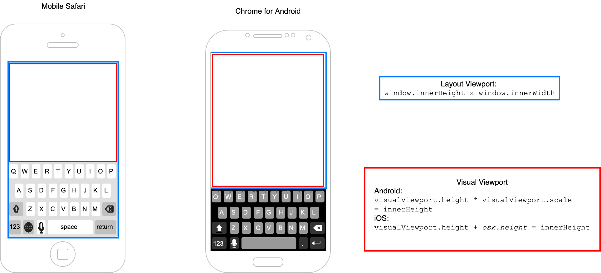
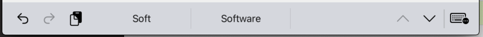

[](https://www.npmjs.com/package/on-screen-keyboard-detector)
[](https://david-dm.org/semmel/on-screen-keyboard-detector)
[](http://reactivex.io)

On-screen keyboard detector
=============================
> Indirect detection of the presence of the on-screen keyboard (OSK) shown by mobile browsers when the user interacts with input controls on a webpage.

Background
----------
This approach employs the browsers layout and visual viewports ([Explainer][5], [MDN][1], [Demo][2]) to 
observe the appearance of the virtual keyboard. 

Simplified, since it's introduction 
- *Mobile Safari* excludes the keyboard from the visual viewport, while
- *Chrome for Android* the keyboard is excluded from both the visual and the layout viewport.



*Chrome's* behaviour makes it necessary to also observe `focusin`, `focusout`, `resize` and `visibilitychange` events. 

Limitations
------
The indirect detection relying on viewport and window DOM events brings some limitations:

- `hidden` and `visible` events are dispatched with a approximate 1 second delay.
- On *Chrome for Android* the keyboard must be *initially hidden* when subscribing to the detector.
- On *iOS* requires *Safari* v. ≥ 13
- On iPad the predictive text bar, which is shown when an *external keyboard* is used, is *not* detected as `visible` keyboard.



Because of these caveats, the straight-forward way of detecting `blur` and `focus` events on inputs should be explored before falling back on this project. 

Install
-------
`npm install on-screen-keyboard-detector`

Usage
-----
### Basic
```javascript
import { subscribe, isSupported } from 'on-screen-keyboard-detector';

if (isSupported()) {
	const unsubscribe = subscribe(visibility => {
		if (visibility === "hidden") {
			// ...
		}
		else { // visibility === "visible"
			// ...
		}
	});
	
	// After calling unsubscribe() the callback will no longer be invoked.
   unsubscribe();
}
```

### React
You can write a simple React hook to make it compatible with react:
```ts
import {useEffect, useState} from 'react'
import {subscribe, isSupported} from 'on-screen-keyboard-detector'


export function useOnScreenKeyboardDetector(): boolean {
    const [keyboardVisible, setKeyboardVisible] = useState<boolean>(false)

    useEffect(() => {
        let unsubscribe

        if (isSupported()) {
            unsubscribe = subscribe((visibility) => {
                setKeyboardVisible(visibility === 'visible')
            })
        }

        return () => {
            if (unsubscribe) {
                unsubscribe()
            }
        }
    }, [])

    return keyboardVisible
}
```

```tsx
function MyReactComponent() {
    const keyboardVisible = useOnScreenKeyboardDetector()

    return (
        <div>
            {keyboardVisible ? 'Keyboard is visible' : 'Keyboard is hidden'}
        </div>
    )
}
```

API
---
### subscribe(listenerCallback): unsubscribe
Begins to observe browser events and invokes the provided callback function
when a change in the keyboard visibility is detected.

| Parameter | Type | Description |
|-----------|------|-------------|
| callback  |`function(String)`| user-defined handler which receives the keyboard visibility changes |

#### Return value
`function(): void` : Unsubscribes to receive updates


### isSupported()
Returns `true` if the browser runtime supports oskd.

Advanced Usage
--------------
### Multiple Subscriptions (PubSub)
PubSub is not part of this module and needs additional tools, e.g. [emittery][3]. See [`demo/pubsub.html`](./demo/pubsub.html)
```javascript
import {subscribe} from 'on-screen-keyboard-detector';
import Emitter from 'emittery';

const emitter = new Emitter();

subscribe(visibility => emitter.emit(visibility));

emitter.on('hidden', function() { /* ... */ });
emitter.on('visible', function() { /* ... */ });
```

Tests
-----
#### Requirements (not listed in `package.json`)
- mocha :coffee:
- chai :tea:
- selenium-webdriver
- a Mac for Mobile Safari tests
- running a local webserver (see `TEST_SERVER` in `package.json`), E.g. run [http-server](https://github.com/http-party/http-server) in the project root folder `http-server . --port 8081`

### Android
For real devices make sure 
- the adb server is running (`adb start-server`), and 
- a device is connected via USB or Wifi  (`adb devices -l`)
- ggf. `adb tcpip 5555` and `adb connect <test phone ip address>` (see `"setup_test"` in `package.json`)
Then run `npm run test:chrome`.

### iOS
Connect a device where `Remote Automatation` is enabled for Safari (see the [Webkit blog][4]). Then run `npm run test:ios`

**iOS tests should be performed manually (see the [demo](./demo) folder), because Webdriver controlled Mobile Safari does not show the virtual keyboard**

Dependencies
-----------
[Ramda](https://ramdajs.com), and [Most](https://github.com/mostjs/core) for the reactive functional infrastructure.

Changelog (See changelog.md)
---------

[1]: https://developer.mozilla.org/en-US/docs/Web/API/Visual_Viewport_API
[2]: http://bokand.github.io/viewport/index.html
[3]: https://github.com/sindresorhus/emittery
[4]: https://webkit.org/blog/9395/webdriver-is-coming-to-safari-in-ios-13/
[5]: https://github.com/bokand/bokand.github.io/blob/master/web_viewports_explainer.md
